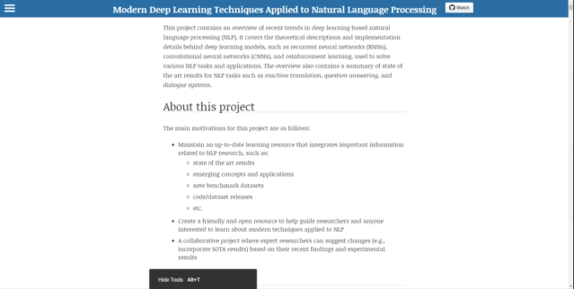

## Modern Deep Learning Techniques Applied to Natural Language Processing
This project contains an overview of recent trends in deep learning based natural language processing (NLP). It covers the theoretical descriptions and implementation details behind deep learning models, such as recurrent neural networks (RNNs), convolutional neural networks (CNNs), and reinforcement learning, used to solve various NLP tasks and applications. The overview also contains a summary of state of the art results for NLP tasks such as *machine translation*, *question answering*, and *dialogue systems*. You can find the learning resource at the following address: [https://nlpoverview.com/](https://nlpoverview.com/). A snapshot of the website is provided below:

## About this project
The main motivations for this project are as follows:
- Maintain an up-to-date learning resource that integrates important information related to NLP research, such as:
    - state of the art results
    - emerging concepts and applications
    - new benchmark datasets
    - code/dataset releases
    - etc.
- Create a friendly and open resource to help guide researchers and anyone interested to learn about modern techniques applied to NLP
- A collaborative project where expert researchers can suggest changes (e.g., incorporate SOTA results) based on their recent findings and experimental results

## Table of Contents
- [Introduction](https://nlpoverview.com/#1)
- [Distributed Representation](https://nlpoverview.com/#2)
    - [Word Embeddings](https://nlpoverview.com/#a-word-embeddings)
    - [Word2vec](https://nlpoverview.com/#b-word2vec)
    - [Character Embeddings](https://nlpoverview.com/#c-character-embeddings)
    - [Contextualized Word Embeddings](https://nlpoverview.com/#d-contextualized-word-embeddings)
- [Convolutional Neural Networks](https://nlpoverview.com/#3)
    - [Basic CNN](https://nlpoverview.com/#a-basic-cnn)
        - [Sentence Modeling](https://nlpoverview.com/#1-sentence-modeling)
        - [Window Approach](https://nlpoverview.com/#2-window-approach)
    - [Applications](https://nlpoverview.com/#b-applications)
- [Recurrent Neural Networks](https://nlpoverview.com/#4)
    - [Need for Recurrent Networks](https://nlpoverview.com/#a-need-for-recurrent-networks)
    - [RNN models](https://nlpoverview.com/#b-rnn-models)
        - [Simple RNN](https://nlpoverview.com/#1-simple-rnn)
        - [Long Short-Term Memory](https://nlpoverview.com/#2-long-short-term-memory)
        - [Gated Recurrent Units](https://nlpoverview.com/#3-gated-recurrent-units)
    - [Applications](https://nlpoverview.com/#c-applications)
        - [RNN for word-level classification](https://nlpoverview.com/#1-rnn-for-word-level-classification)
        - [RNN for sentence-level classification](https://nlpoverview.com/#2-rnn-for-sentence-level-classification)
        - [RNN for generating language](https://nlpoverview.com/#3-rnn-for-generating-language)
    - [Attention Mechanism](https://nlpoverview.com/#d-attention-mechanism)
    - [Parallelized Attention: The Transformer](https://nlpoverview.com/#e-parallelized-attention-the-transformer)
- [Recursive Neural Networks](https://nlpoverview.com/#5)
    - [Basic model](https://nlpoverview.com/#a-basic-model)
- [Deep Reinforced Models and Deep Unsupervised Learning](https://nlpoverview.com/#6)
    - [Reinforcement learning for sequence generation](https://nlpoverview.com/#a-reinforcement-learning-for-sequence-generation)
    - [Unsupervised sentence representation learning](https://nlpoverview.com/#b-unsupervised-sentence-representation-learning)
    - [Deep generative models](https://nlpoverview.com/#c-deep-generative-models)
- [Memory-Augmented Networks](https://nlpoverview.com/#7)
- [Performance of Different Models on Different NLP Tasks](https://nlpoverview.com/#8)
    - [POS tagging](https://nlpoverview.com/#a-pos-tagging)
    - [Parsing](https://nlpoverview.com/#b-parsing)
    - [Named-Entity Recognition](https://nlpoverview.com/#c-named-entity-recognition)
    - [Semantic Role Labeling](https://nlpoverview.com/#d-semantic-role-labeling)
    - [Sentiment Classification](https://nlpoverview.com/#e-sentiment-classification)
    - [Machine Translation](https://nlpoverview.com/#f-machine-translation)
    - [Question Answering](https://nlpoverview.com/#g-question-answering)
    - [Dialogue Systems](https://nlpoverview.com/#g-dialogue-systems)
    - [Contextualized Embeddings](https://nlpoverview.com/#i-contextual-embeddings)
## How to Contribute?
There are various ways to contribute to this project. 

- You can propose text additions in this public [shared document](https://docs.google.com/document/d/1wN8_D5szivA11wkybecu2TyrRZhYkpH_QxkmlRktuW4/edit?usp=sharing) for now. We will help edit and revise the content and then further assist you to incorporate the contributions to the project. 
- Refer to the [issue section](https://github.com/omarsar/nlp_overview/issues/1) to learn more about how you can help. 
- Or you can make suggestions by submitting a [new issue](https://github.com/omarsar/nlp_overview/issues/new). More detailed instructions coming soon.

## Build site locally
If you are planning to change some aspect of the site (e.g., adding section or style) and want to preview it locally on your machine, we suggest you to build and run the site locally using `jekyll`. Here are the instructions:
- First, check that `Ruby 2.1.0` or higher is installed on your computer. You can check using the `ruby --version` command. If not, please install it using the instructions provided [here](https://www.ruby-lang.org/en/documentation/installation/).
- After ensuring that Ruby is installed, install Bundler using `gem install bundler`. 
- Clone this repo locally: `git clone https://github.com/omarsar/nlp_overview.git`
- Navigate to the repo folder with `cd nlp_overview`
- Install Jekyll: `bundle install`
- Run the Jekyll site locally: `bundle exec jekyll serve`
- Preview site on the browser at `http://localhost:4000`

## Maintenance
This project is maintained by [Elvis Saravia](https://github.com/omarsar) and [Soujanya Poria](https://github.com/soujanyaporia). You can also find me on [Twitter](https://twitter.com/omarsar0) if you have any direct comments or questions. A major part of this project have been directly borrowed from the work of [Young et al. (2017)](https://arxiv.org/abs/1708.02709). We are thankful to the authors.